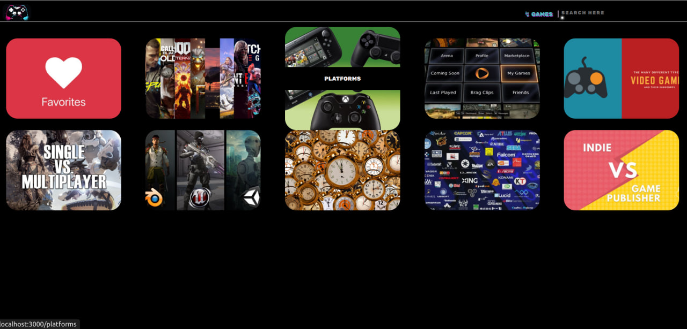

# Gaming Library

## React Personal Project No: 1

# Table of Contents

1. Project Summary
2. Purpose of the Project
3. Technologies
   1. Language
   2. Libraries
   3. Styling
   4. Database
4. Files & Functions
   1. public
      1. images
      2. index.html
   2. src
      1. assets/imgs
        1. games
        2. header
        3. links
      2. CSS
        1. game/table.css
        2. main
          1. game.css
          2. games.css
          3. home.css
        3. navbar
          1. searchForm
             1. inputDiv.css
             2. searchResultsDiv.css
             3. typeDiv.css
             4. typesDiv.css
          2. headerDiv.css
        4. index.css
        5. load.css
      3. hooks
        1. useDispatch.js
        2. useFilter.js
        3. useLength.js
        4. useScroll.js
        5. useTypes.js
        6. useURL.js
        7. useWidth.js
      4. links
        1. Game.js
        2. Home.js
        3. Platform.js
      5. navbar
        1. InputDiv.js
        2. Navbar.js
        3. SearchResultsDiv.js
        4. TypeDiv.js
        5. TypesDiv.js
      6. error/Error.js
      7. utilities
        1. Context.js
        2. gameAnimations.js
        3. GameDiv.js
        4. GameImgs.js
        5. GameName.js
        6. Links.js
        7. reducer.js
      8. App.js
      9. gamesList.json
      10. index.js
      11. Load.js
   3. .gitignore
5. Videos
6. Live Page
7. Credits
8. Licence

# 1. Project Summary

Gaming library categorizes games by their genres, platforms, years etc. This way we can easily find the games we are searching for either by manually finding via homepage links or with the search bar on top. We can also save our favorite games by clicking an icon to reach them easily in the future.

I do not upload all the images to decrease repo size therefore you would not be able to download and run it. You can check the live page from section 6.

# 2. Purpose of the Project

I wanted to test my react skills to create a more complex project than I have ever created. This is a personal project which I created in my free times in my first semester of IT.

# 3. Technologies

## 1. Language

- [x] JavaScript

## 2. Libraries

- [x] React
- [x] Jquery

## 3. Styling

- [x] CSS

## 4. Database

- [x] JSON
- [x] Local Storage

# 4. Files & Functions

## 1. public

### 1. images

This is a folder which contains the logo of the page to be able to use in html file. It is used to show the logo in browsers.

This folder also contains an example folder to upload an example screenshot of the page to this article.

### 2. index.html

Contains the root div for react and logo links.

## 2. src

### 1. assets/imgs

Contains 3 folders which keeps all the imgs for the app. All images are resized to 500px width to decrease size of the app.

#### 1. games

This folder keeps all the imgs of games by their name. Each game has its own folder and those folder have 3 images named "1.jpg", "2.jpg", "3.jpg".

#### 2. header

Contains the home page link image

#### 3. links

This folder has several folders seperated by the main page link names. Each of them contain their own company, genre, service etc. images to be used inside related pages.

### 2. CSS

All of styling css folders and files are located here. Each of them seperated by related pages.

#### 1. game/table.css

This folder contains the styling of individual game page information table styling.

Example path: http://localhost:3000/game/Hades

#### 2. main

##### 1. game.css

This file contains the styling of individual game page styling of game name, youtube video and images.

Example path: http://localhost:3000/game/Hades

##### 2. games.css

This file contains the styling of related page styling for the games.

Example path: http://localhost:3000/platforms/microsoft_windows

##### 3. home.css

This file contains the styling of the home page main div. It includes the image links' styling.

#### 3. navbar

All navigation bar styling is created here.

##### 1. searchForm

Contains the styling of the search type and search bar.

###### 1. inputDiv.css

Styling of search bar.

###### 2. searchResultsDiv.css

Styling of found results via search bar.

###### 3. typeDiv.css

Styling of the arrow entity, selected option for search bar and seperator line on right.

###### 4. typesDiv.css

Styling of the option types of search bar.

##### 2. headerDiv.css

Styling of the image link.

#### 4. index.css

Contains the main styling of tags such as div, a, form etc.

#### 5. load.css

Contains the load more button styling.

### 3. hooks

Parameters used by hooks are: state, dispatch, length, paths.

state: Gets information from reducer.js
dispatch: Sets the information to reducer.js
length: DOM length
paths: URL paths which comes from useURL

#### 1. useDispatch.js

Parameters: state, dispatch, length.

Sets ID to 10 in the start.
Checks the URL.
Depending on URL path, gets the information about the games from the state,state.list, state.favorites, state.platforms and for all other links, and creates an array. This array contains all the games.

Example path: http://localhost:3000/platforms/xbox_one

In this example filteredTypeList array contains xbox one games and sets it to state.filteredTypeList 4. When state.filtered information changes in another file, useDispatch sets state.domLength by length parameter.

Note: state.filtered contains the information of 10 games filtered from filteredTypeList, if possible.

#### 2. useFilter.js

Parameters: state, dispatch, paths.

Gets state.filteredTypeListand state.id from useDispatch. Uses this information to create state.filtered.
Uses paths parameter to check URL paths and depends on it sets state.show. This displays load more button or not.

#### 3. useLength.js

Parameters: state

Gets state.filteredTypeList and state.domLength. Depends on their lenghts are equal or not, it displays the load more button or not.

#### 4. useScroll.js

This hook uses the hook useEffect to add and remove event listeners for scrolling in window. If page is on top then navigation bar's color will be same with the body. If page is not on top then the color of navbar changes.

#### 5. useTypes.js

Parameters: state, dispatch, paths

Gets state.list. Uses this information to set states such as state.platforms, state.services etc.
Also saves the information to localstorage.

#### 6. useURL.js

Parameters: paths

Gets the document URL as parameter. Uses this array to create various combinations.

#### 7. useWidth.js

Parameters: dispatch

Uses the hook useEffect to add and remove event listener depends on window.innerWidth. This hook is used to check width and set some DOM width in different components.

### 4. links

Contains the components for pages such as platform links, game pages, home page.

#### 1. Game.js

Components which are used: GameName, GameImgs, Error.

Gets the informations from gamesList.json for the individual game and sets all the links, images, iframe youtube video for the game's individual page.

#### 2. Home.js

Component which is used: Links

This is the component which is used for the Home path.

Example: http://localhost:3000

#### 3. Platforms.js

Component which is used: Links

This component is used for all main page links.

Examples: http://localhost:3000/platforms, http://localhost:3000/genres

### 5. navbar

Contains the components for the navigation bar parts.

#### 1. InputDiv.js

This is a component for the search bar.
On page load it starts an animation under search bar with a straight line extends to right side and focuses to search bar for searching
Checks the value of type div to be able to check the proper object key. 

Example: If the type div value is engines than you can search your games by the game engine.

Type div value: "ENGINES"
Search bar value: "UNREAL ENGINE 3"
Result div values: "Batman Arkham Knight", "Mortal Kombat 11".

On value change of input, it searches the game state.list to find the proper games and creates the game links to search result div.
On focus and focus out it creates the animation for search bar underline div. It also displays and hides the search result div.

#### 2. Navbar.js

Contains all navbar components and logo.

#### 3. SearchResultsDiv.js

This is the component which shows the game results depending on type div and search bar values.
It filters the regex results to 5 most related results only to not load all the data to page.
On mouse enter it increases the height of the related game and zooms. Also filters the other games to be less visible.
On mouse out it reverses the mouse enter function.
On click it navigates you to related game page.

#### 4. TypeDiv.js

This is the component to choose the proper key to search for.
On mouse enter it changes the colors of the div. Moves the text shadow further. Rotates the arrow.
On mouse down it displays the other types as a dropdown. They come to screen with an animation by sliding from left to right.
On second mouse down to type div or any other DOM element, it will hide the types div.

#### 5. TypesDiv.js

This is the component which deals the functions of the all types in the dropdown menu.
On mouse enter it fades the already selected text inside type div. Changes the color of mouse enter text and creates an animation of text shadow and letter spacing.
On mouse leave reverses the effects of the mouse enter.
On click it swaps the selected search type with the current clicked one.

### 6. error/Error.js

This component is used to display an error page message on screen when URL is not properly entered.
If URL doesn't exist this component will be called inside other components.

### 7. utilities

This folder contains the files which are functions or components used from other main components.

#### 1. Context.js

This only includes the createContext function to be able to use globally in whole app to transfer the same data.

#### 2. gameAnimations.js

Contains the functions of the game animations for subpaths.
Depends on width of the screen size, it uses different values to create game images and functions.
On mouse enter it filters all other games' images to be less visible. 

Zoom in to the current image and shows other 2 images of the chosen game.

We can use our cursor to look at other images to change their z-index.
On mouse out it will reverse the effect.
On click it will navigate us to the related game page.

#### 3. GameDiv.js

This is the component which contains the individual game.
Takes the state.filtered information to use it to create games in the current url path.
This component contains 3 images, GameName component and a link to navigate game page.
All the needed data for the game comes from gamesList.json file.

#### 4. GameImgs.js

Component which includes images and functions to be used in selected game page.
Gets the 3 image of the game and shows them in the page. 
All of them has their own border color and hover border color animations.
On mouse over scales up the image and reverse on mouse leave.
On click it shows the image on up in wider size.
Displays an "X" button to be able to close the image. This button has its own hover animation as well. 

#### 5. GameName.js

This component includes the game's name and a heart icon.
On mouse over this heart gets bigger.
On click, if the game is not selected before changes its background to a dark red and color to white.
Adds this game to state.favorites and also to local storage.

#### 6. Links.js

Component which creates the links for the home page and for the subpaths of that links.
On mouse over image spreads to up and down from the middle and shows the page name.
On mouse leave it reverses the effect.
On click it navigates to the page.

#### 7.reducer.js

This file includes the default state and reducer function to be used to get data and change data globally in the app.

### 8. App.js

Includes all CSS file imports.
Sets the local storage data to state.
Dynamically routes to all pages.

### 9. gamesList.json

Local data which includes all the game informations.

### 10. index.js

Main file of the app.

### 11. Load.js

A button which is used to load more of the desired page links.
If links are more than 10 this button displays itself.
On click it shows up to 10 more links and so on. If there are not more links anymore this button hides itself.

## 2. .gitignore

Node modules and assets which contains all the images for the page are ignored to upload. To be able to run the page check Live Page section.

# 5. Videos

# 6. Live Page

# 7. Credits

This project created by Emre Kunduraci. All the information and images are taken from open sources. 
All the images are resized by and sliced horizontally by me.
The informations are collected in December 2022 therefore they may be changes over time.

# 8. Licence
